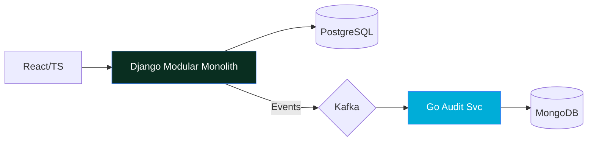

  

    
  
  `Brazil (UTC-3)` • `International Contractor (W-8BEN)` • `EN/PT/ES`

---

### ⚡ Quick Trace
- **Focus**: Scalable APIs & Cloud-Native Systems using **Go**, **Python (Django)**, and **React/TS**.
- **Background**: Years in Quality Engineering, now applying a "zero-defect" mindset to Software Architecture.
- **Expertise**: `Clean Architecture` • `DDD` • `Event-Driven Systems` • `Terraform/Azure`.

---

### 🚀 Featured System: HealthCore API
*Click the image below for the Live Demo*

  

#### 🏗️ Architecture & Performance

- **Efficiency**: **85% p99 reduction** (180ms → 26ms) via N+1 elimination.
- **Reliability**: 283 tests, 90%+ coverage, gRPC communication, HIPAA-aligned and RBAC.
- **Stack**: Django, Go, React, Kafka, Redis, Terraform, Azure.

> [📂 Source Code](https://github.com/Daniel-Q-Reis/HealthCoreAPI) • [👨‍💻 Developer Docs](https://app.danielqreis.com/dqr-health/developers)

---

### 🛠️ Core Stack
`Languages`: Go, Python, TypeScript | `Infra`: Azure, AWS, Docker, Kubernetes, Terraform | `Data`: PostgreSQL, Redis, MongoDB, Kafka

---
## Currently
- Open to **Full-Cycle/Backend Engineer** opportunities (Remote, international contractor)
- Deepening expertise in **query optimization**, **CI/CD pipelines**, and **test automation**
- Reach me: [danielqreis@gmail.com](mailto:danielqreis@gmail.com)
---
