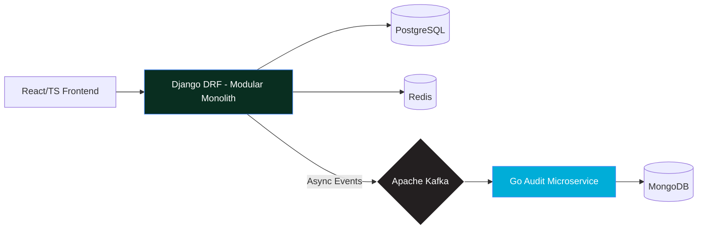

  

`Brazil (UTC-3)` • `International Contractor (W-8BEN)` • `EN/PT/ES`

---

##  About Me
**Backend Engineer** capable of delivering full-stack solutions in **Go**, **Python (Django)**, and **React/TypeScript** with a focus on **Clean Architecture**, **Domain-Driven Design**, and **cloud-native systems**.

* **Engineering Mindset**: Background in Operations & Quality Engineering — analytical thinking and systematic problem-solving now applied to software architecture.
* **Rapid Progression**: Built **12+ projects** in 2025, demonstrating a fast transition from fundamentals to enterprise-level distributed systems.
* **Quality First**: Intensive hands-on training focused on observability, scalability, and production-grade reliability.

---

## Featured Project: HealthCore API

**Enterprise Hospital Management Platform** — Production healthcare system with HIPAA-aligned architecture  
*Django + Go + React/TypeScript · PostgreSQL · Redis · Kafka · MongoDB · Terraform · Azure*

###  System Architecture

 **[Live Demo](https://app.danielqreis.com/dqr-health)** ·  **[For Developers](https://app.danielqreis.com/dqr-health/developers)** — API Docs, Metrics & Endpoints

### Key Achievements
| Area | Highlights |
|------|------------|
| **Architecture** | Modular Monolith · 12 DDD Bounded Contexts · FHIR/HL7 Aligned · 23 ADRs |
| **Polyglot Services** | Go 1.24 Audit Microservice · gRPC (Protocol Buffers) · <100ms latency |
| **Frontend** | React 18 + TypeScript · Feature-Sliced Design · 25+ UI Components · Dark Mode |
| **Infrastructure** | Terraform IaC · Azure Container Apps · Custom Domains · SSL/HTTPS · OAuth 2.0 |
| **Performance** | 85% p99 reduction (180ms → 26ms) via N+1 elimination · Kafka event monitoring |
| **Quality** | 283 tests · 90%+ coverage · MyPy strict (0 errors) · 100K+ lines of code |
| **Observability** | Prometheus · Grafana Dashboards · Azure Application Insights · Structured Logging |
| **Resilience** | Circuit Breaker (PyBreaker) · Idempotency Middleware · Retry Logic |
| **AI Integration** | Gemini 2.5 (drug analysis) · GPT-4 (health recommendations) |
---

## 📂 Other Notable Projects
* **[DrugStore API](https://github.com/Daniel-Q-Reis/drugstore_api)**: Pharmacy SaaS • Python/Django • AWS (EC2, RDS, S3) • Chart.js Analytics.
* **[Social API](https://github.com/Daniel-Q-Reis/social_api)**: Social Network Backend • Go • PostgreSQL • Clean Architecture • JWT/RBAC.
* **[Goroutines Study](https://github.com/Daniel-Q-Reis/GoroutinesFromBeginningToAdvanced)**: Go Concurrency Deep Dive — Built without AI for deep understanding.

---
## Tech Stack
### Languages & Frameworks

### Databases & Messaging

### Cloud & DevOps

### Architecture Patterns
`Clean Architecture` · `Hexagonal (Ports & Adapters)` · `Domain-Driven Design` · `Feature-Sliced Design` · `Event-Driven` · `Microservices` · `Modular Monolith`
---
## GitHub Stats

---
## Currently
- Open to **Full-Cycle/Backend Engineer** opportunities (Remote, international contractor)
- Deepening expertise in **query optimization**, **CI/CD pipelines**, and **test automation**
- Reach me: [danielqreis@gmail.com](mailto:danielqreis@gmail.com)
---
> *"Production-grade mindset. Enterprise architecture skills. Ready to contribute."*
